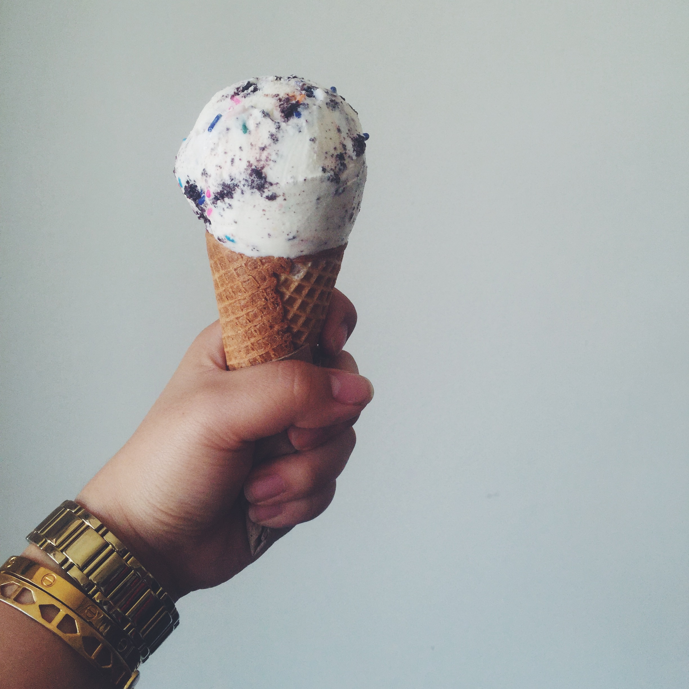
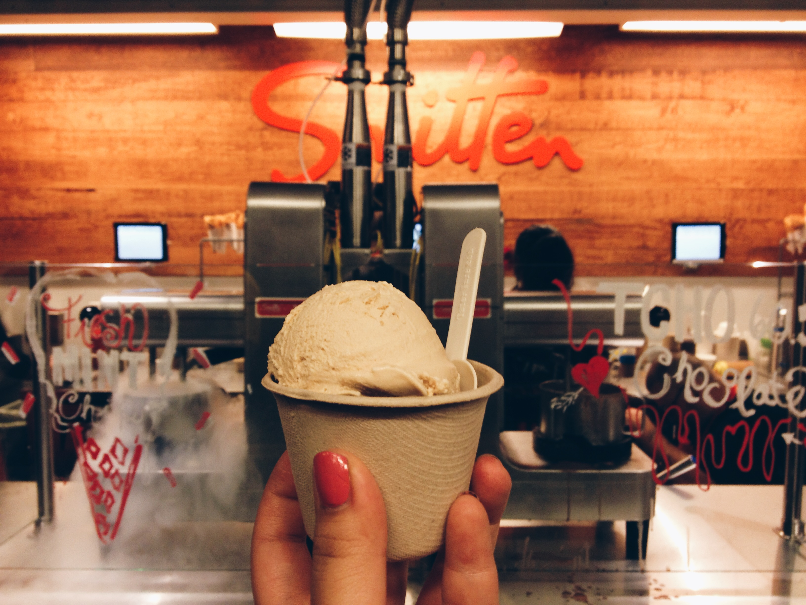
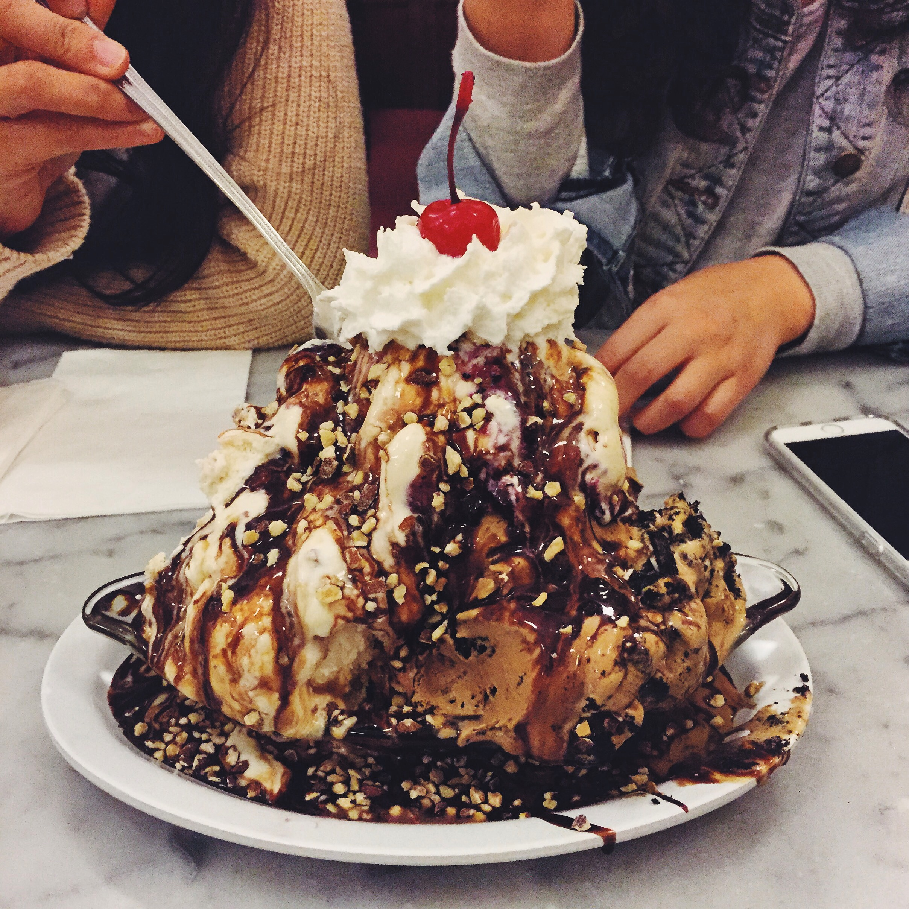
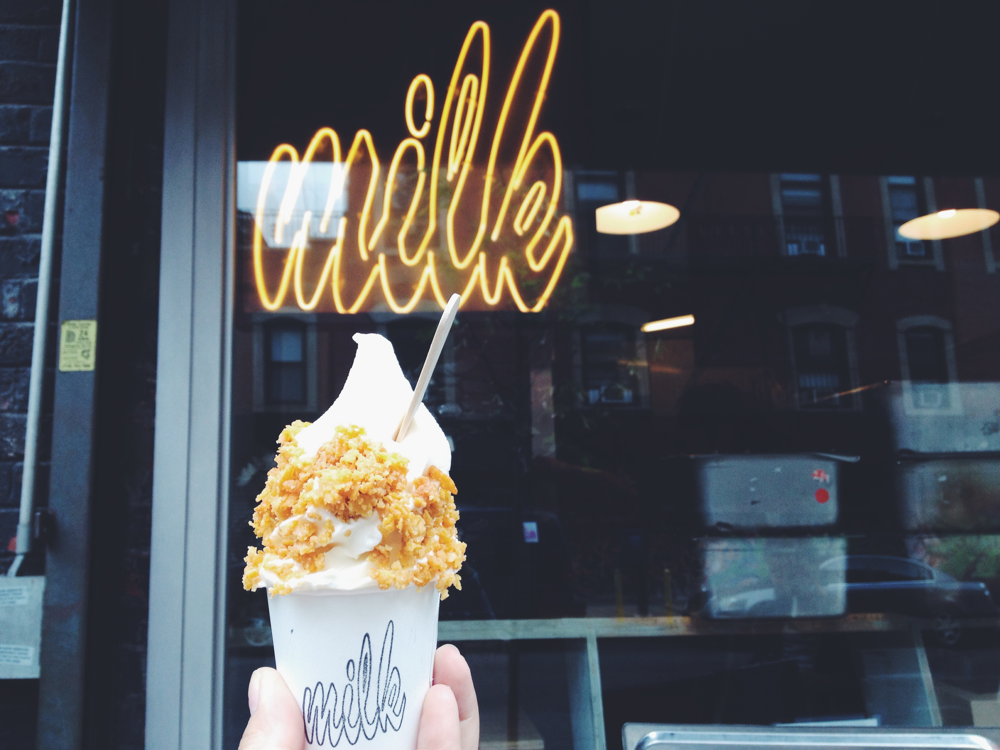
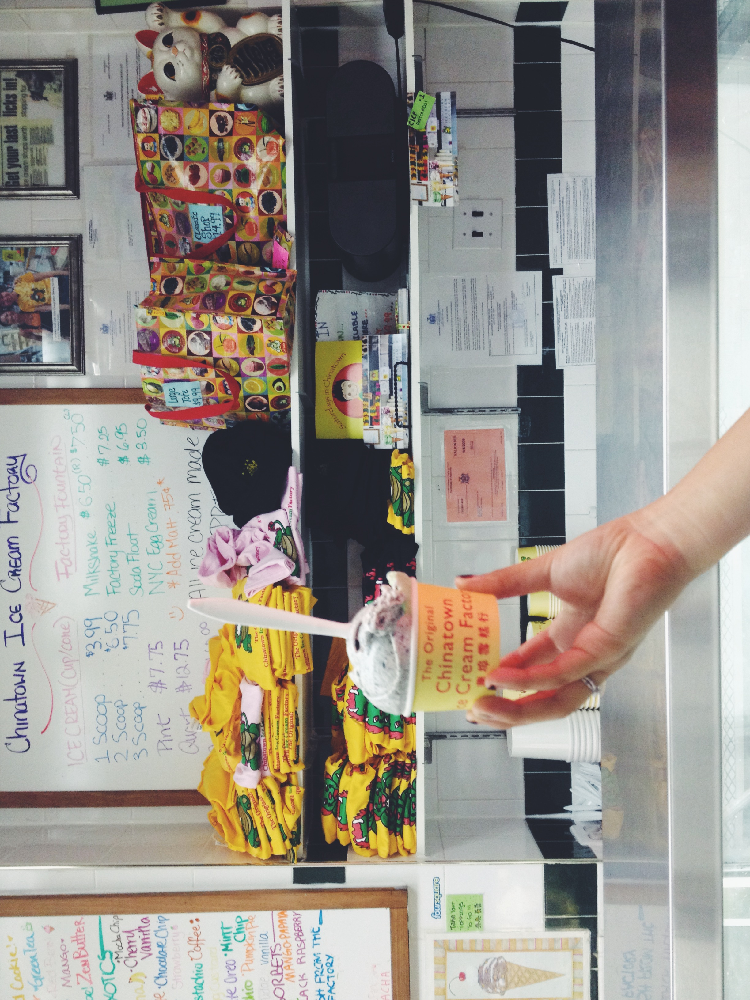

 

On a less serious note, I really enjoy ice cream and when I was in college, I wrote a [blog post](http://ashleykanggg.tumblr.com/post/94611347893/ice-creameries-in-the-bay) dedicated to all the "*artisanal*" ice cream I had in the Bay Area. This jumpstarted the idea to write about all the ice cream I've tried thus far. Due to age, but mostly fear of developing diabetes and gaining weight, I don't consume ice cream at the rate in which I used to (during my glory days - aka college), but I still enjoy a good ice cream from time to time.

 

  

 

### San Francisco, CA

#### [Mr. and Mrs. Miscellaneous](https://www.yelp.com/biz/mr-and-mrs-miscellaneous-san-francisco)

  

 

One of my favorite ice creameries of all time. Putting this at the top of my list for favorite ice cream places in the Bay Area may be controversial since there are many people who adamantly believe that Bi-Rite is the *best* creamery in San Francisco, but I think what seals the deal for me is the creaminess of the ice cream at Mr. and Mrs. Miscellaneous. I love the fact that every bite is so indulgent. Brownie points for packing the ice cream all the way down the cone.

Price: $3.50 for a single scoop (1 flavor)

Side Note: Mr. And MRs. Miscellaneous only lets you try two flavors. There isn’t much seating and unfortunately there is a $5 minimum in order to use a credit card.

 

#### [Bi-Rite Creamery](https://www.yelp.com/biz/bi-rite-creamery-san-francisco)

 

I really enjoy teas and flower scents - aptly, one of my favorite flavors at Bi-Rite is Honey Lavender. Tea and flower scents are very divisive. Some of my friends dislike Honey Lavender as they say it tastes like soap, but to me, it is beautifully crafted - strong enough that it lingers on my tongue but light enough that it doesn’t overwhelm my taste buds. I’ve also had the Salted Caramel and Ricanelas and I thoroughly enjoyed every bite. The flavors served at Bi-Rite are very rich (but not too creamy in comparison to Mr. and Mrs. Miscellaneous). 

Price: $4.75 for a small (1-2 flavors)

Suggestion: If the weather is nice, you should grab a sandwich at Ike’s, eat it at Dolores Park, and then visit Bi-Rite. 

 

#### [Humphry Slocombe Ice Cream](https://www.yelp.com/biz/humphry-slocombe-ice-cream-san-francisco-4?osq=humphreys) 

 

It took me a while to try Humphry’s - I had it junior year in college while hanging out with my high school best friend in the Ferry Building. I tried Candied Ginger, and I really enjoyed it! When I dug into my ice cream, I was pleasantly surprised to find chunks of actual ginger (since I had assumed the ginger would only be the flavoring). In terms of richness and creaminess, I would say it’s in the middle of both Bi-Rite and Mr. and Mrs. Miscellaneous. 

Price: $4.75 for a single

Con: They didn’t serve cones (at least when I visited).

 

### Berkeley, CA

#### [Ici Ice Cream](https://www.yelp.com/biz/ici-ice-cream-berkeley)

 

**NOW CLOSED** This is a Berkeley staple. I’ve been here too many times, ranging from when they first open in the morning to barely making the cut-off right before they close. Their homemade cone is a must-try! My favorite flavor at Ici is Rose Vanilla. One thing's for sure - Ici does **not** shy away from eclectic flavors: banana curry, pink peppercorn, Anise Almond Grappa Raisin, etc. This is a little icier and less creamy/rich than the other ice cream shops listed above.

Price: $3.50 (cup) or $4.75 (cone) for one scoop

Pros: So close to my apartment (8 minute walking distance, 4 minutes if I run). They also have unique flavors (as mentioned above) which change *somewhat* daily, and you can try up to 4 of them! Also if you’re in between flavors but you only want one scoop, you can get “half-scoops” (but only in a cup - you can still ask for a cone and they'll place the cone on top of your ice cream in a cup)! Brilliant, right? 

Cons: Long lines, primarily because there are so many Berkeley students drowning their sorrows or celebrating their accomplishments at Ici - including me.

Side Note: The workers here have fantastic memories! I don’t understand how they remember all of the flavors.

 

#### [Smitten Ice Cream](https://www.yelp.com/biz/smitten-ice-cream-oakland-3)

 

Okay, so I’m not a huge fan. I think the idea behind how they make their ice cream is absolutely cool - they use liquid nitrogen if you didn’t know (yay science!). However, *personally* I don’t really like the texture of the ice cream. It feels like cold, too-smooth-almost-in-a-fake-way buttercream frosting. 

Price: $5 for a small scoop

 

#### [Fentons Creamery](https://www.yelp.com/biz/fentons-creamery-oakland-2)

 

Did you know that Fentons Creamery is featured in *Up*? It's a cute ice creamery and diner (you can order food there). I've only tried their ice cream sundaes, which are as decadent and delicious as they look. You can also try the **Fenton's Challenge**, in which you are given 15 minutes to finish a massive sundae, comprised of 1 lb of vanilla ice cream, 1 lb of strawberry ice cream, 1 lb of chocolate ice cream, and doused with every topping and syrup/sauce that comes with a normal sundae. I can proudly say that I finished the challenge slightly under 5 minutes. Would I ever do it again? I'd say **hell no**. 

Price: $6.50 for a single scoop.

 

#### [CREAM](https://www.yelp.com/biz/cream-berkeley-5)

 

CREAM stands for "Cookies Rule Everything Around Me." Berkeley equivalent of Diddy Riese in Los Angeles (see below). Famous for their ice cream cookie sandwiches. The ice cream itself isn't too special, but add the cookies (which are served warm) and you're in for a sweet treat.

Price: $3.99 for an ice cream sandwich, $2.49 for a single scoop

Cons: Ice cream can melt quickly since it is sandwiched between two warm cookies. Also, the lines get crazy especialy during nighttime on the weekends.

 

#### [Almare Gelato Italiano](https://www.yelp.com/biz/almare-gelato-italiano-berkeley)

 

Small shop near the Berkeley BART entrance serving decent gelato. My go-to flavor here is Stracciatella - have yet to be disappointed. They also give you a good serving size. They also have a stamp card so take one and bring it with you if you will be frequenting this place.

Price: $3.25 for a single scoop (kids cup)

Pros: They let you try as many flavors as you want and will let you do half scoops.

Cons: Inconsistent service, limited seating.

 

#### [John's Ice Cream](https://www.yelp.com/biz/johns-ice-cream-berkeley)

 

Back in the day, John's Ice cream used to be $1 flat. Then, I heard that they raised their price by $0.10 on one random day either my junior or senior year of college (my memory is a little hazy). I'm not joking when I say that adding $0.10 to the price greatly upset, dare I say outraged, people. You pay for what you get - the quality is decent, but nowhere near astonishing. It does the job. 

Price: $1.75 for a single scoop

Cons: Cash only

 

#### Tara's Organic Ice Cream

#### Three Twins Ice Cream

#### Secret Scoop Thai Gelato

 

### Los Angeles, CA

#### Salt & Straw Ice Cream

#### Jeni's Splendid Ice Creams

#### McConnell's Fine Ice Creams

#### Honeymee

#### Diddy Riese

#### Carmela Ice Cream Co.

#### Midori Matcha Cafe

#### Owl's

#### Cafe Bora

 

### New York, NY

#### [Van Leeuwen Artisan Ice Cream](https://www.yelp.com/biz/van-leeuwen-artisan-ice-cream-new-york-3)

 

#### Morgenstern's Finest Ice Cream

#### Milk Bar

#### The Original Chinatown Ice Cream Factory

#### il laboratorio del gelato

#### Taiyaki NYC

 

### Dublin, Ireland

#### Murphys Ice Cream

 

### Venice, Italy

#### Grom Gelato

 

### Florence, Italy

#### Gelateria La Carraia

 

### Rome, Italy

#### Palazzo del Freddo Giovanni Fassi

#### Old Bridge Gelateria

 

### Seoul, Korea

#### Oseullo

#### Footlong Ice Cream