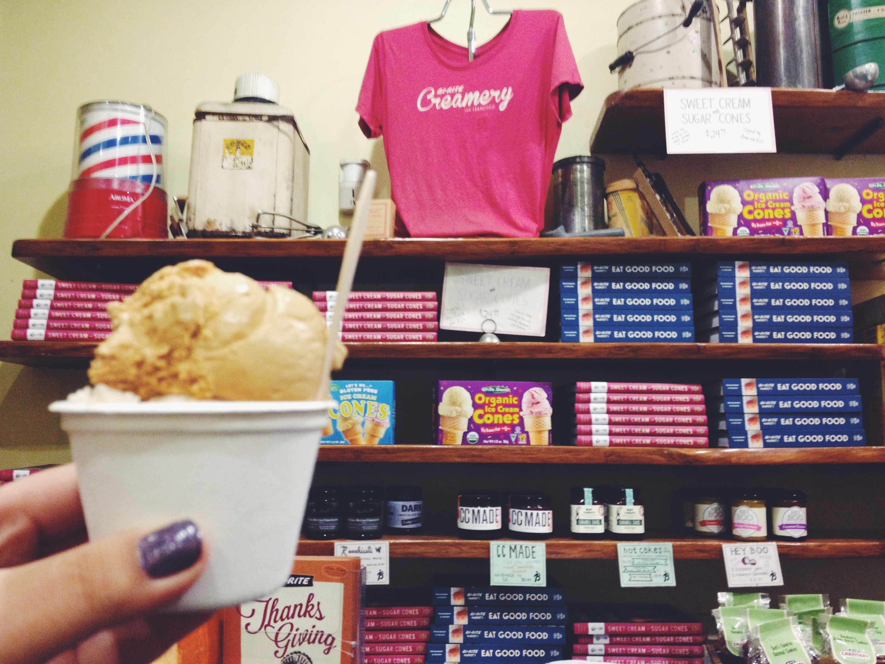
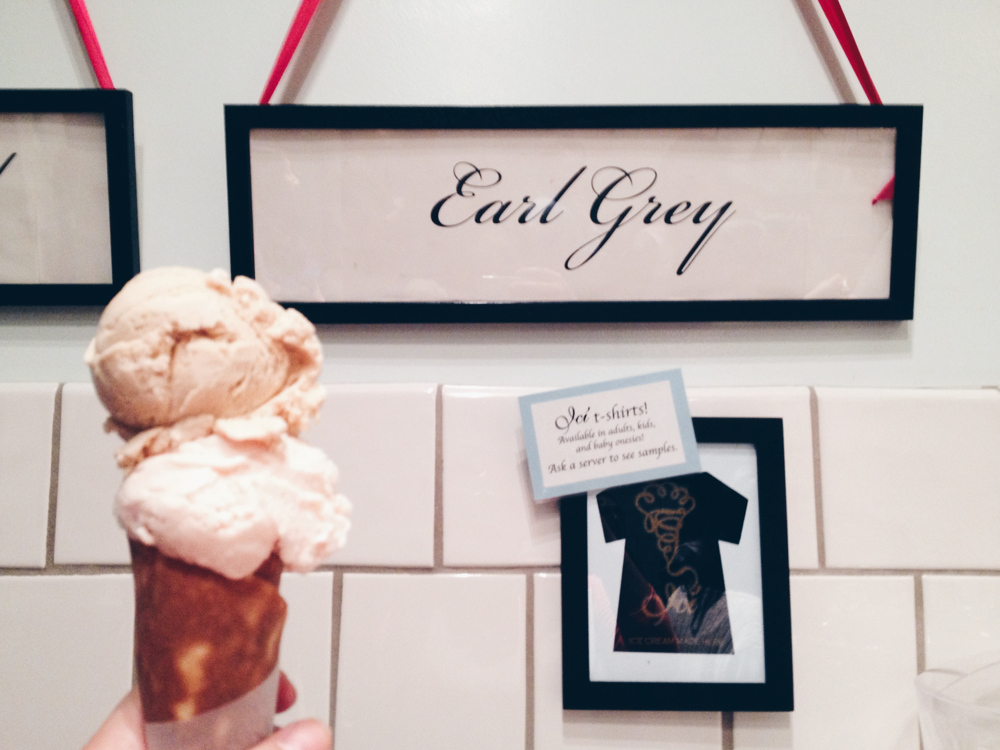

On a less serious note, I really enjoy ice cream and when I was in college, I wrote a [blog post](http://ashleykanggg.tumblr.com/post/94611347893/ice-creameries-in-the-bay) dedicated to all the "*artisanal*" ice cream I had in the Bay Area. This jumpstarted the idea to write about all the ice cream I've tried thus far. 

 

  

 

##San Francisco, CA

### [Mr. and Mrs. Miscellaneous](https://www.yelp.com/biz/mr-and-mrs-miscellaneous-san-francisco)

  

 

One of my favorite ice creameries of all time. Putting this at the top of my list for favorite ice cream places in the Bay Area may be controversial since there are many people who adamantly believe that Bi-Rite is the *best* creamery in San Francisco, but I think what seals the deal for me is the creaminess of the ice cream at Mr. and Mrs. Miscellaneous. I love the fact that every bite is so indulgent. Brownie points for packing the ice cream all the way down the cone.

Side Note: The shop is cute and hipster-ish. They only let you try two flavors. There isn’t much seating and unfortunately there is a $5 minimum in order to use a credit card.

### [Bi-Rite Creamery](https://www.yelp.com/biz/bi-rite-creamery-san-francisco)

 

I really enjoy teas and flower scents, and aptly, one of my favorite flavors at Bi-Rite is Honey Lavender. Some of my friends say that the Honey Lavender tastes like soap, but I think the taste is strong enough that it lingers on my tongue but weak enough that it doesn’t overwhelm my taste buds. I’ve also had the Salted Caramel and Ricanelas and I thoroughly enjoyed every bite. The flavors served at Bi-Rite are very rich (but not too creamy, in comparison to Mr. and Mrs. Miscellaneous). 

Suggestion: If the weather is nice, you should grab a sandwich at Ike’s, eat it at Dolores Park, and then visit Bi-Rite. 

### [Humphry Slocombe Ice Cream](https://www.yelp.com/biz/humphry-slocombe-ice-cream-san-francisco-4?osq=humphreys) 

 

It took me a while to try Humphry’s - I had it while hanging out with my high school best friend in the Ferry Building. I tried Candied Ginger, and I really enjoyed it! When I dug into my ice cream, I was surprised to find chunks of actual ginger (since I had assumed the ginger would only be the flavoring). In terms of richness and creaminess, I would say it’s in the middle of both Bi-Rite and Mr. and Mrs. Miscellaneous. 

Con: They didn’t serve cones (at least when I visited).

 

### Berkeley, CA

### [Ici Ice Cream](https://www.yelp.com/biz/ici-ice-cream-berkeley)

 

**NOW CLOSED** This is a Berkeley staple. I’ve been here too many times: ranging from when they first open in the morning to barely making the cut-off line right before they close. Their homemade cone is a must-try! Again, my favorite flavors at Ici’s are teas and flower scents. This includes Earl Grey, Honey Lavendar, Rose Vanilla (there are actually many more flavors I enjoy but I can’t remember them at the moment). This is a little icier and less creamy/rich than the other ice cream shops listed above.

Pros: So close to school! They also have unique flavors (which change daily) and you can try up to 4 of them! Also if you’re in between flavors but you only want one scoop, you can get “half-scoops” (but only in a cup)! Brilliant, right? 

Cons: Long lines (primarily because there are so many college students - including me)

Side Note: The workers here have fantastic memories! I don’t understand how they remember all of the flavors.

### [Smitten Ice Cream](https://www.yelp.com/biz/smitten-ice-cream-oakland-3)

 

### [Fentons Creamery](https://www.yelp.com/biz/fentons-creamery-oakland-2)

 

### CREAM 

### Almare Gelato Italiano

### John's Ice Cream

### Tara's Organic Ice Cream

### Three Twins Ice Cream

### Secret Scoop Thai Gelato

 

## Los Angeles, CA

### Salt & Straw Ice Cream

### Jeni's Splendid Ice Creams

### McConnell's Fine Ice Creams

### Honeymee

### Diddy Riese

### Carmela Ice Cream Co.

### Midori Matcha Cafe

### Owl's

### Cafe Bora

 

## New York, NY

### [Van Leeuwen Artisan Ice Cream](https://www.yelp.com/biz/van-leeuwen-artisan-ice-cream-new-york-3)

 

### Morgenstern's Finest Ice Cream

### Milk Bar

### The Original Chinatown Ice Cream Factory

### il laboratorio del gelato

### Taiyaki NYC

 

## Dublin, Ireland

### Murphys Ice Cream

 

## Venice, Italy

### Grom Gelato

 

## Florence, Italy

### Gelateria La Carraia

 

## Rome, Italy

### Palazzo del Freddo Giovanni Fassi

### Old Bridge Gelateria

 

## Seoul, Korea

### Oseullo